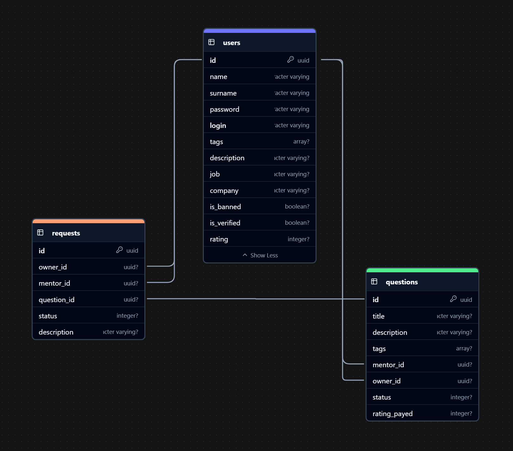
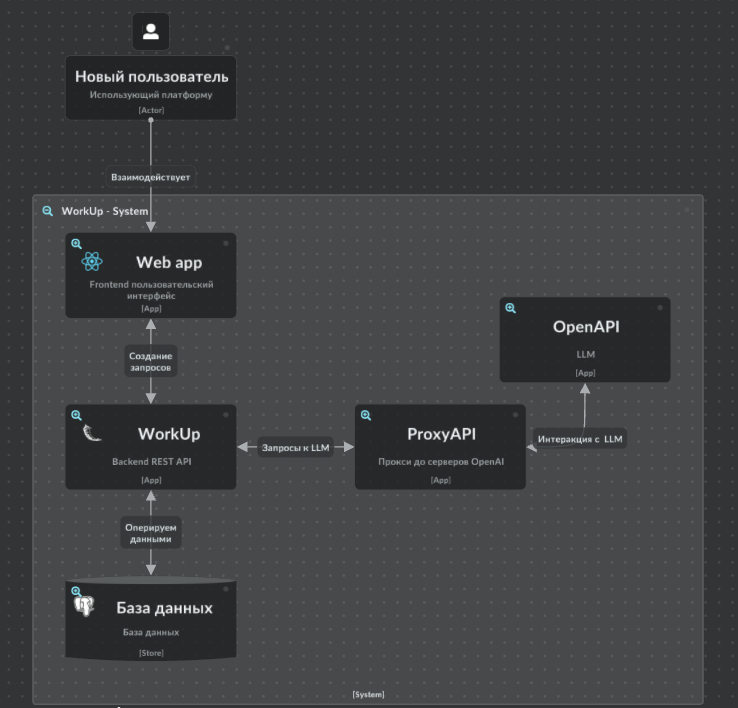

### *This is fork repo of my project on prodcontest final*

# PROD — Командный этап

Welcome aboard!

В данном репозитории вы найдёте:
- Пример простого приложения на Python для генерации аватаров по никнейму.
- Рабочий пример конфигурации GitLab CI/CD, который поможет вам автоматически деплоить приложение на виртуальные машины.

## О проекте

### Цель
Цель этого проекта — предоставить участникам готовое решение для деплоя приложения с использованием GitLab CI/CD на виртуальные машинах. 

Мы ожидаем, что в первый день вместе с менторами вы настроите пайплайн, который:
- Соберёт и загрузит в Gitlab Registry образ приложения.
- Автоматически задеплоит его на предоставленную виртуальную машину `на 80 порту`.

### Приложение
Приложение написано на Python и генерирует уникальные аватары на основе введённого никнейма.

### Конфигурирование

> Мы добавим данные ENV в ваши командные проекты автоматически.

Для настройки деплоя на вашу виртуальную машину необходимо задать 3 ENV в проекте:
- `$ENV_SSH_USER` - имя пользователя
- `$ENV_SSH_HOST` - адрес вашей виртуальной машины
- `$ENV_PRIVATE_KEY_BASE64` - приватный ключ от пользователя в формате Base64


# 📊 Архитектура проекта Team-33 Backend

## 🌟 Обзор архитектуры

Наш проект - это современный backend-сервис, разработанный на Python с использованием Flask. Мы постарались сделать его максимально гибким, надёжным и простым в поддержке. Основная идея - чтобы с кодом было приятно работать как сейчас, так и через год.

Мы опирались на несколько важных принципов:

- **Разделение ответственности** - каждая часть кода занимается только своим делом
- **Инверсия зависимостей** - модули высокого уровня не зависят от деталей низкого уровня
- **Слоистая архитектура** - код разделен на слои API, бизнес-логики и инфраструктуры
- **DRY (Не повторяйся)** - минимизация дублирования кода

## 📂 Структура проекта

Проект организован в понятную структуру папок:

```
src/
├── app/
│   ├── api/ - REST API интерфейс
│   │   ├── admin_route/ - Эндпоинты администрирования
│   │   ├── ai_route/ - Интеграция с AI сервисами
│   │   ├── auth_route/ - Аутентификация и авторизация
│   │   ├── question_route/ - Управление вопросами
│   │   ├── request_route/ - Обработка запросов
│   │   ├── tags/ - Работа с тегами
│   │   ├── test_route/ - Тестовые эндпоинты
│   │   ├── user_route/ - Управление пользователями
│   │   └── openapi.yaml - Документация API
│   ├── core/ - Бизнес-логика и доменные модели
│   │   └── models/ - Pydantic модели данных
│   └── infrastructure/ - Инфраструктурный код
│       ├── ai_repository.py - Интеграция с AI сервисами
│       ├── base_repository.py - Базовые репозиторные функции
│       ├── database.py - ORM модели и подключение к БД
│       └── jwt_repository.py - Обработка JWT токенов
└── main.py - Точка входа приложения
```

## 💻 Технологический стек

Мы используем современные технологии:

| Технология | Для чего используем |
|------------|----------|
| **Python** | Основной язык разработки - простой и мощный |
| **Flask** | Легкий веб-фреймворк, не перегружающий проект |
| **SQLAlchemy** | ORM для удобной работы с базой данных |
| **Pydantic** | Валидация данных на входе и создание моделей |
| **JWT** | Безопасная аутентификация с токенами |
| **PostgreSQL** | Надежная база данных для хранения информации |
| **Swagger/OpenAPI** | Автодокументация нашего API |
| **Werkzeug** | Маршрутизация запросов |

## 🏛️ Особенности архитектуры

### 1. Многослойная архитектура

Наш проект разделен на три основных слоя:

- **API** - обрабатывает запросы пользователей и возвращает ответы
- **Бизнес-логика** - содержит правила работы приложения
- **Инфраструктура** - отвечает за работу с базой данных и внешними сервисами

Такое разделение помогает содержать код в порядке и упрощает тестирование.

### 2. Модель данных

У нас есть четыре основных сущности:

- **Пользователи (User)** - люди, использующие систему
- **Вопросы (Question)** - проблемы, которые создают пользователи
- **Запросы (Request)** - запросы к менторам для решения вопросов
- **Теги (Tags)** - метки для категоризации вопросов и экспертиз

### 3. Безопасность

Мы уделили особое внимание безопасности:

- **JWT-токены** для аутентификации пользователей
- **Защита от SQL-инъекций** благодаря ORM
- **Валидация всех входных данных** с помощью Pydantic
- **Защита конфиденциальности** через секретные ключи

### 4. Интеграция с AI

Одна из самых интересных особенностей - интеграция с искусственным интеллектом:

- Использование AI для улучшения контента
- Автоматическое создание заголовков по описаниям
- Улучшение текстов и выделение проблем
- Сохранение исходного языка при обработке текста

### 5. Удобное API

Наше REST API спроектировано максимально удобно:

- **Автодокументация** через Swagger/OpenAPI
- **Логичная структура адресов** - все эндпоинты интуитивно понятны
- **Правильные HTTP-методы** (GET, POST, PUT, DELETE, PATCH)
- **Стандартные статус-коды** для понятных ответов
- **Возможность версионирования** для будущих изменений


### 6. Архитектура базы данных


### 7. C4 диаграмма


## 📈 Масштабируемость

Наша архитектура легко масштабируется:

- **Независимость от сервера** - код может работать на разных машинах
- **Эффективная маршрутизация** через Werkzeug
- **Гибкость работы с базой данных**
- **Возможность кэширования** для оптимизации

## 📝 Заключение

Мы создали современную, надежную и гибкую архитектуру для проекта Team-33 Backend. Она обеспечивает высокую производительность, безопасность и простоту поддержки.

Четкая структура кода и следование принципам SOLID делают систему устойчивой к изменениям и легко расширяемой.

Интеграция с AI-сервисами показывает, что мы смотрим в будущее и готовы к новым технологическим вызовам.

Ниже приведён краткий отчёт о покрытии тестами и основных сценариях тестирования.

---

## Отчёт по покрытию тестами

- **Файл `test1.py`:**  
  - Всего строк: 141  
  - Пропущено строк: 20  
  - Покрытие тестами: **86%**

- **Файл `test2.py`:**  
  - Всего строк: 242  
  - Пропущено строк: 31  
  - Покрытие тестами: **87%**

- **Итого по проекту:**  
  - Всего строк: 383  
  - Пропущено строк: 51  
  - Общее покрытие тестами: **87%**

---

## Сценарии тестирования

### Сценарии из `test1.py`
- **Регистрация пользователя:** проверка корректности POST-запроса на `/auth/reg/` и получения JWT-токена.  
- **Авторизация (Логин):** отправка POST-запроса на `/auth/login`, проверка получения и декодирования JWT-токена.  
- **Обновление данных пользователя:** проверка PATCH-запроса на `/auth/` с изменением данных пользователя.  
- **Получение статистики администратора:** проверка GET-запроса на `/admin/stats/` и наличия ключа `total_users`.  
- **Получение списка пользователей:** проверка GET-запроса на `/admin/users/` и структуры ответа в формате JSON.  
- **Поиск менторов по тегам:** проверка POST-запроса на `/tags/mentors/` с передачей тегов и параметром `X-Total-Count` в заголовках.

### Сценарии из `test2.py`
- **Регистрация и авторизация основного пользователя:** автоматическая регистрация в `setUpClass` и последующий логин с использованием JWT-токена в запросах.  
- **Регистрация и авторизация ментора:** создание аккаунта с тегами `"mentor"`, `"python"`, проверка логина и извлечение `mentor_id`.  
- **Обновление данных пользователя:** проверка PATCH-запроса на `/auth/` для изменения профиля.  
- **Получение статистики и списка пользователей:** проверка GET-запросов на `/admin/stats/` и `/admin/users/`.  
- **Создание и получение вопросов:** отправка POST-запроса на `/question/` для создания вопроса, затем GET-запрос для проверки наличия вопроса (по UUID).  
- **Создание запросов к менторам:**  
  - Массовое создание: POST на `/request/{question_uuid}/many/` с несколькими `mentor_id`.  
  - Одиночное создание: POST на `/request/{question_uuid}/{mentor_id}/` с извлечением `request_id`.  
- **Получение входящих и принятых запросов:** проверка GET-запросов на `/request/incoming/` и `/request/accepted/`.  
- **Административные операции:** блокировка и разблокировка пользователя, установка статуса верификации, получение списка всех запросов.  
- **Отметка запроса как решённого:** проверка POST-запроса на `/request/{request_id}/solved/` и реакции сервера при отсутствии подтверждения запроса.

